# App Development Technical Documentation

## Table of Contents Example

1. [Overview](#1-overview)
2. [System Architecture](#2-system-architecture)
3. [Feature Details](#3-feature-details)
4. [Data Structure](#4-data-structure)
5. [UI/UX Design](#5-uiux-design)
6. [API Documentation](#6-api-documentation)
7. [Setup & Deployment](#7-setup--deployment)
8. [Maintenance & Reference](#8-maintenance--reference)

## 1. Overview

- **App Name:** eStudy GPT
- **Version:** 1.0.0
- **Summary of Purpose and Key Features:** Personalized, real-world language learning app
- **Target Users:** Who wants to learn english

## 2. System Architecture

- **Overall Architecture Diagram:**
  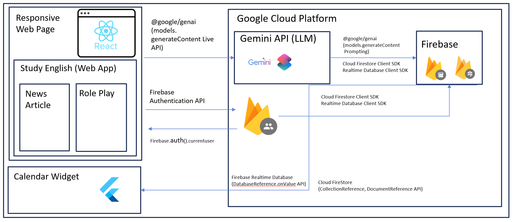
  _High Level Diagram_

  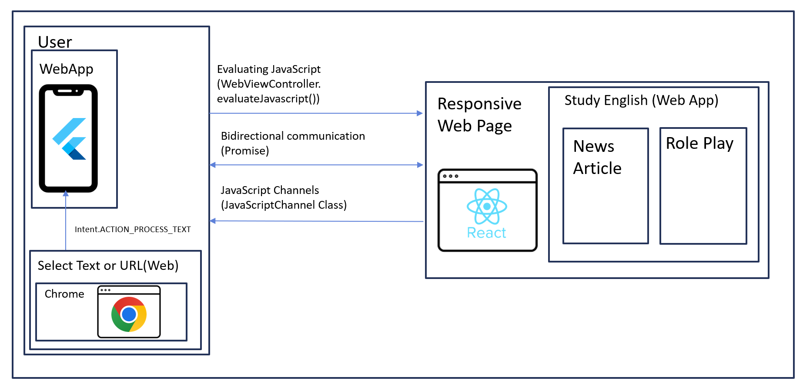
  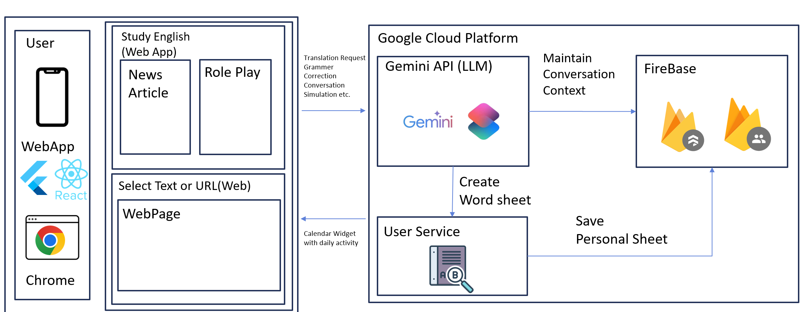
  _Low Level Diagram_

- **Technology Stack:**
  - Language:
    - Flutter: Dart
    - React: JavaScript/TypeScript
  - Framework:
    - Flutter
    - React
  - Library:
    - Firebae SDKs (Authenication, Firestore, Realtimbe Database)
    - Google Genrative AI SDK (Gemini API)
  - Database:
    - Firebase Firestore (NoSQL, real-time database)
  - Others:
    - Firebase Authenication (user management)
    - Google Gemini API (generative AI features)
- **Third-party Integration:**
  - **Firebase:**
    - Used for authenication, real-time databas (Firestore), ananlytics, and other backend services for both Flutter and React
  - **Google Gemini API:**
    - Integrated for generative AI features such as text generation, chatbots, content summarization, etc.
    - Accessed via REST API or Google Generative AI SDK, with secure API key management

## 3. Feature Details

### Login

- **Purpose:**
  Allows users to sign in using Google account for personalized access

- **How It Works:**

  1. User click `Sign in with Google` button to login with Google account
  2. Credentials are sent to Firebase Authentication
  3. If authentication is successful, user data and token are returned
  4. On failure, error message is shown

- **Screen/Flow:**
  - Login Screen -> Home Screen
  - `Sign in with Google` button triggers Google login popup
  - On success, navigate to Home Screen
  - On failure, display error message
- **Exception Handling:**
  - Invalid credentials: Show "Check your account again."
  - Network failure: Show "Please check your internet connection."
  - Server error: Log error and show generic error message

### Web Content & PDF Scraping with App Deep Linking Feature

- **Purpose:**  
  Allow users to scrape sentences (text) or PDF documents from a web browser and open them directly in the estudy_gpt app for AI-powered language learning.

- **How It Works:**

  1. User selects text or a PDF file in the web browser.
  2. User clicks the "estudy_gpt" button (via share menu or deep link).
  3. The selected text or PDF is sent to the estudy_gpt app using a share intent or deep link.
  4. The app receives the content, detects its type, and extracts text if needed.
  5. The app displays language learning options.
  6. User selects an option and receives AI-generated feedback.

- **Screen/Flow:**

  - Select text or PDF in browser → Share to estudy_gpt → App opens with shared content → Content type detected and text extracted → User selects analysis option → AI result displayed

- **Exception Handling:**
  - No shared content: Show "No shared content found."
  - Invalid or empty input: Show error and prompt retry.
  - PDF/text extraction errors: Show error and allow retry.
  - API/network errors: Show error and allow retry.

### WebView-React Bridge & User Authentication Data Sync

- **Purpose:**
  Enable seamless communication between Flutter app (using WebView) and React-based web app. Specifically, authenticate the user in Flutter (Firebase Auth) and securely pass user information (email, display name, photo, access token, uuid) to React app running inside WebView. Also, handle navigation and content scraping messages from web app.

- **How It Works:**

  1. Flutter app authenticates the user using Firebase Auth
  2. Upon loading the WebView, Flutter injects the authenticated user's data into the React web app using JavaScript (`window.postMessage`)
  3. WebView listens for messages from web app via JavaScript channel (`FlutterBridge`):

     - If the message type is `router:push`, WebView navigates to specified path

  4. When the page finishes loading, the user data is sent again to ensure synchronization
  5. The WebView also fetches the page title and expose it via a callback for UI updates

- **Screen/Flow:**
  - User logs in via Flutter (`Firebase Auth`)
  - WebView loads the initial URL (React web app)
  - On page load, user data is posted to the React app
  - React app can request navigation or send content back to Flutter via `window.postMessage` (handled by the Flutter JavaScript channel)
  - App responds to navigation or content scraping requests as needed
  - The page title is optionally updated in Flutter UI via the `onTitleChanged` callback
- **Exception Handling:**
  - If user info or access token is unavailable, no data is sent to React
  - Any unhandled message types from the web app are logged using `debugPrint`
  - If navigation fails (e.g., invalid path), the error is not propagated to the user but can be logged for debugging
  - Network or authentication errors are managed by the Firebase Auth flow and surfaced to the user as appropriate

### Chatting

- **Purpose:**
  Enable seamless real-time messaging between a Flutter app and a React-based web application, allowing authenticated users to chat with a chatbot within the web interface. Securely synchronize user authentication data, transmit conversation data in real time, and provide a personalized chat experience.

- **How It Works:**

  - After a user logs in via the Flutter app, an authentication success message (`auth:success`) along with user information is sent to the web (WebView/iframe) via postMessage.
  - On the React web side, the useFlutterMessage(setUserData) hook listens for the window message event. When an authentication success message is received, the user information is saved to state.
  - Once authenticated user data is stored, the web chat component (ChatRoom) is activated, initializing the chat session and enabling real-time message exchange.
  - Messages entered by the user are processed on the web and, if necessary, sent to a server or AI chatbot API. Response messages are displayed in the chat interface.
  - Communication between Flutter and the web is bidirectional, using window.postMessage and window.addEventListener(`"message", ...`).

- **Screen/Flow:**

  - App Launch → Firebase Authentication (Flutter)
  - Upon successful authentication, Flutter sends user info to the web via postMessage
  - The web receives the authentication message with useFlutterMessage and stores user info
  - Once user info is set, the user enters the chat screen (ChatRoom)
  - User enters a message → Web sends the message to server/API/AI chatbot
  - Response message is received and displayed in the chat list in real time
  - (Optional) After chat ends, provide conversation analysis, feedback, or level adjustment features

- **Exception Handling:**

  - Unauthenticated State:

    - If the authentication message is not received or user info is missing, restrict access to the chat screen and display a login prompt or loading screen.

  - Message Reception Failure:

    - If the message format is invalid or a communication error occurs, display an error message and provide a retry option.

  - Network/Server Error:

    - If communication with the server or chatbot API fails, show an appropriate message and a retry button.

  - No Chat Data:

    - If there is no previous conversation history, display a message such as “No chat history found.”

  - Authorization/Security Issues:

    - If authentication data is forged or expired, terminate the session and redirect to the login screen.

  - Real-Time Sync Errors:
    - If message synchronization is delayed, display a loading indicator and notify the user of network status.

### Wrong Note Screen (Firebase-based User Wrong Notes)

- **Purpose:**  
  Allow users to view their personalized wrong note records, fetched from Firebase Firestore, within the Flutter app after authentication.

- **How It Works:**

  1. User logs in via Firebase Authentication.
  2. The app fetches the user's wrong note data from Firestore using their UID or email.
  3. Wrong notes are displayed in a list using a real-time stream or one-time fetch.
  4. Each note shows details such as question, user's answer, correct answer, explanation, and date.

- **Screen/Flow:**

  - App start → Login/Sign up → Navigate to Wrong Note screen
  - Fetch wrong note data from Firestore
  - Display list of wrong notes
  - Tap on a note to view details
  - (Optional) Add, edit, or delete notes

- **Exception Handling:**
  - If not logged in, redirect to login screen.
  - If Firestore fetch fails, show error message or retry option.
  - If no notes exist, display a “No wrong notes found” message.
  - Show loading indicator or error message if network issues occur.

### Calendar

- **Purpose:**
  Provide users with a motivational, interactive calendar experience that visually tracks their daily learning progress and achievements. The feature also delivers personalized motivational messages and enables users to quickly check or update their learning status directly from their device’s home screen via native widgets.

- **How It Works:**

  - The main calendar UI is implemented in Flutter, displaying each month with daily statuses based on user activity (e.g., whether a wrong note was created on a given day).

  - When the user completes a daily task (such as creating a wrong note), the app determines if the task was completed and generates a motivational message using a static method (ChallengeCalendar.getMotivationalMessage).

  - The app uses the home_widget package to save relevant data (e.g., task completion status, motivational message, and current date) to shared storage accessible by native home screen widgets.

  - After saving the data, the app triggers a widget update using HomeWidget.updateWidget, ensuring that the home screen widget reflects the latest user progress and motivational message.

  - The widget can be initialized and configured to listen for user interactions, such as widget clicks, which can launch the app or perform other actions.

  - The home screen widget itself is implemented natively (SwiftUI for iOS, XML/Kotlin for Android), but receives its data from the Flutter app via the home_widget interface

- **Screen/Flow:**

  - App launch → Calendar screen displays monthly view with daily progress indicators.

  - User completes a daily learning task (e.g., creates a wrong note).

  - App calls ChallengeCalendarWidget.updateWidget to:

    - Generate a motivational message based on task completion.

    - Save the completion status, message, and current date via HomeWidget.saveWidgetData.

    - Trigger a widget update with HomeWidget.updateWidget.

  - Home screen widget displays the latest status and message.

  - (Optional) User taps the widget, which launches the app or navigates to the relevant calendar/task screen.

- **Exception Handling:**

  - Data Sync Issues:

    - If saving data to the widget fails (e.g., due to platform restrictions or storage errors), the app logs the error and can prompt the user to retry or check permissions.

  - Widget Update Failure:

    - If the widget fails to update (e.g., due to misconfigured provider names or missing native setup), the app logs the error for debugging and may show a notification to the user.

  - App Group/Permission Issues (iOS):

    - If setAppGroupId is not called or misconfigured, data sharing between the app and widget will fail. The app should check for and handle this case, possibly alerting the user to reinstall or update permissions.

  - No Task Completed:

    - If the user has not completed a daily task, the calendar and widget display an encouraging message to motivate the user to engage.

  - Widget Interaction Issues:

    - If the widget click event is not handled correctly, the app should log the URI and provide fallback navigation or feedback.

## 4. Data Structure

- **DB Design (ERD, Table Structure):**

  - Firebase structure(Realtime Database):

    ```
    users (Collection)
    └─ {userId} (Document)
       ├─ chat (Collection)
       |    └─ updatedAt: string    
       |    └─ {chatId} (Document)
       |         ├─ characterId: int
       |         ├─ content: string
       |         ├─ role: string
       |         └─ timestamp: int
       ├─ levelHistory (Collection)
       |    └─ {index} (Document)
       |         ├─ changedAt: int
       |         ├─ level: string
       |         └─ reason: string    
       ├─ recentScores (Collection)
       |    └─ totalSession: int
       |    └─ updatedAt: string
       |    └─ {index} (Document)
       |         ├─ score: int
       |         └─ timestamp: string    
       └─ wrongNotes (Collection)
            └─ {wrongNoteId} (Document)
                 ├─ analyzedAt: string
                 ├─ messages: (collection)
                 |    └─ {index} (Document)
                 |          └─ content: string
                 ├─ newCefrLevel: string
                 ├─ previousCefrLevel: string
                 ├─ score: int
                 └─ summary: string

    ```

- **Main Data Models and Attributes:**

  | Field      | Type          | Description                 |
  | :--------- | :------------ | :-------------------------- |
  | question   | string        | The content of the question |
  | answer     | string        | The correct answer          |
  | userAnswer | string        | The user's submitted answer |
  | cratedAt   | timestamp     | Creation timestamp          |
  | updatedAt  | timestamp     | Last updated timestamp      |
  | tags       | array[string] | Tags (optional)             |

- **API Specifications (Input/Output Data Format):**

  - Created/Update Input Example

    ```
    {
      "question": "What is the capital of France?",
      "answer": "Paris",
      "userAnswer": "Lyon",
      "createdAt": "2025-06-03T06:00:00.000Z",
      "updatedAt": "2025-06-03T06:00:00.000Z",
      "tags": ["geography", "europe"]
    }

    ```

  - Read Output Example
    ```
    [
      {
        "wrongNoteId": "abc123",
        "question": "What is the capital of France?",
        "answer": "Paris",
        "userAnswer": "Lyon",
        "createdAt": "2025-06-03T06:00:00.000Z",
        "updatedAt": "2025-06-03T06:00:00.000Z",
        "tags": ["geography", "europe"]
      }
    ]
    ```

## 5. UI/UX Design

- **List of Screens and Flowchart:**

  - Splash Screen (`splash_screen.dart`)

  - Login Screen (`login_screen.dart`)

  - Main Screen (`main_screen.dart`)

  - Calendar Screen (`calendar_screen.dart`)

  - Wrong Note Screen (`wrong_note_screen.dart`)

  - Profile Screen (`profile_screen.dart`)

  - Setting Screen (`setting_screen.dart`)

  - Personal Screen (`personal_screen.dart`)

  - Method Text Screen (`method_text_screen.dart`)

  - Media Stream Screen (`media_stream_screen.dart`)

  - Initial Media Screen (`initial_media_screen.dart`)

  - Webview Bridge (`webview_bridge.dart`)

  - Chat functionality is provided via WebView.

- **Example User Flowchart**

  ```
  Splash Screen
      ↓
  Login Screen
      ↓
  Main Screen
  ┌──────────────┬────────────────┬──────────────┬
  ↓              ↓                ↓              ↓
  Personal    Chatting          Wrong note    Setting
  Screen      Screen            Screen        Screen
    ↓            ↓
  Method      Webview Bridge
  Text        (chat)
  Screen
  ```

- **Detailed Description for Each Screen:**

  - Splash Screen

    - Purpose: Displays the app logo and initial loading animation when the app launches.

    - Key Features: App initialization, automatic login check, navigation to the next screen.

  - Login Screen

    - Purpose: User authentication (login).

    - Key Features: Email/password input fields, login button, password recovery link.

  - Main Screen

    - Purpose: The main hub of the app, providing navigation to core features.

    - Key Features: Bottom navigation bar or tab bar, access to Calendar, Wrong Note, Profile, etc.

  - Calendar Screen

    - Purpose: Manage and view schedules and events.

    - Key Features: Calendar view, add/edit/delete events.

  - Wrong Note Screen

    - Purpose: Manage wrong answers or notes.

    - Key Features: List of wrong notes, detail view, add/edit notes.

  - Profile Screen

    - Purpose: View and edit user information.

    - Key Features: Profile picture, nickname, edit personal info.

  - Setting Screen

    - Purpose: App settings and preferences.

    - Key Features: Notification settings, account management, other configurations.

  - Personal Screen

    - Purpose: Personalized features such as learning history and statistics.

  - Method Text Screen

    - Purpose: Provide learning methods and text-based resources.

  - Media Stream Screen

    - Purpose: Media (video/audio) streaming functionality.

  - Initial Media Screen

    - Purpose: Initial guide or selection screen for media content.

  - Webview Bridge (Chat)

    - Purpose: Provides chat functionality via an embedded WebView.

  - Key Features: Chat UI and interaction handled through a web-based interface within the app.

- **Wireframes/Design Mockups:** (Image/Link)

  - `splash_screen.png`: App logo and loading indicator
    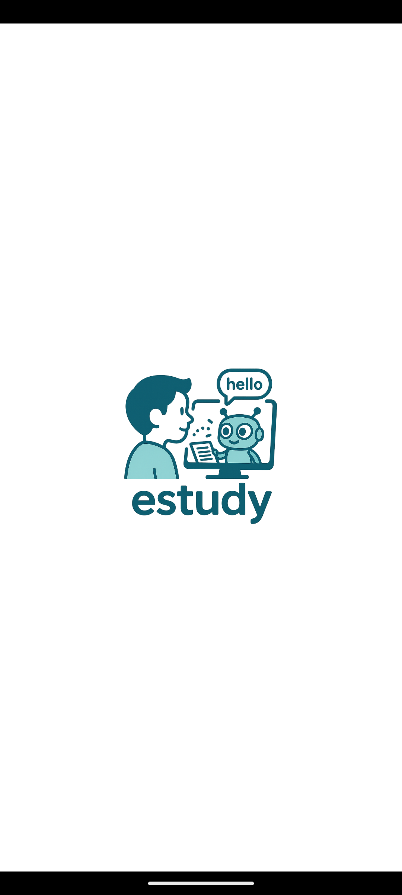
  - `login_screen.png`: Email/password fields, login button
    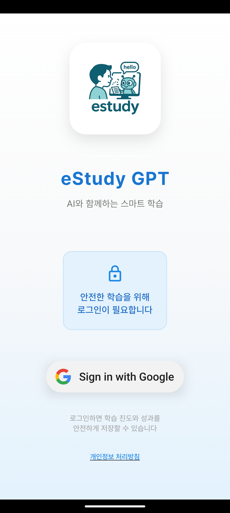
  - `chatting_screen.png`: Bottom navigation bar, main menu icons
    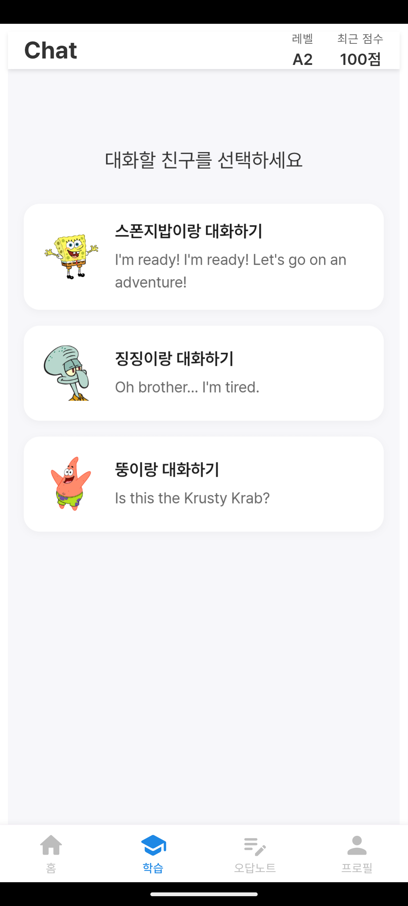
    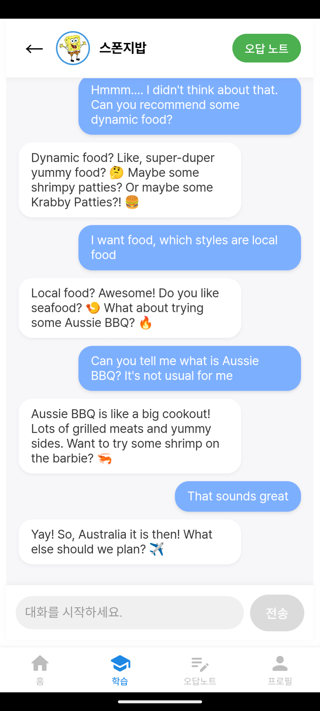
  - `calendar_screen.png`: Personal Profile, Calendar UI, event list
    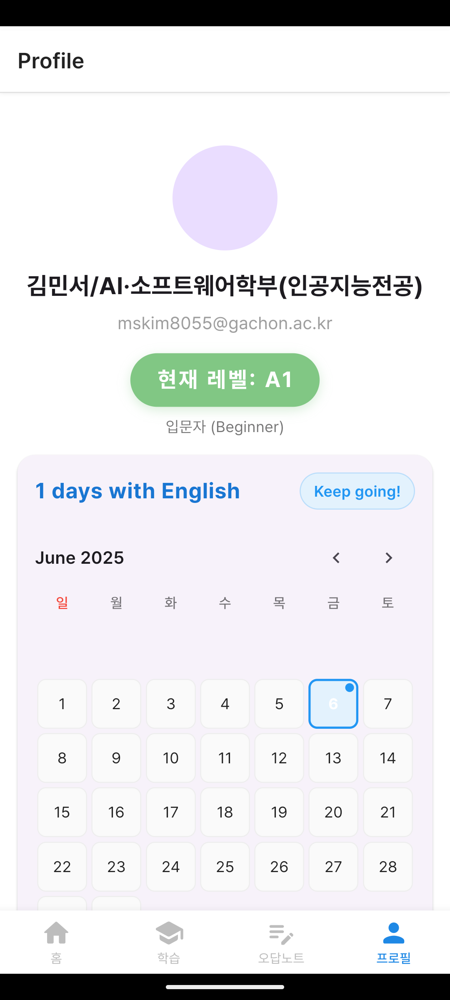
  - `result_screen.png`: Show chatting result
    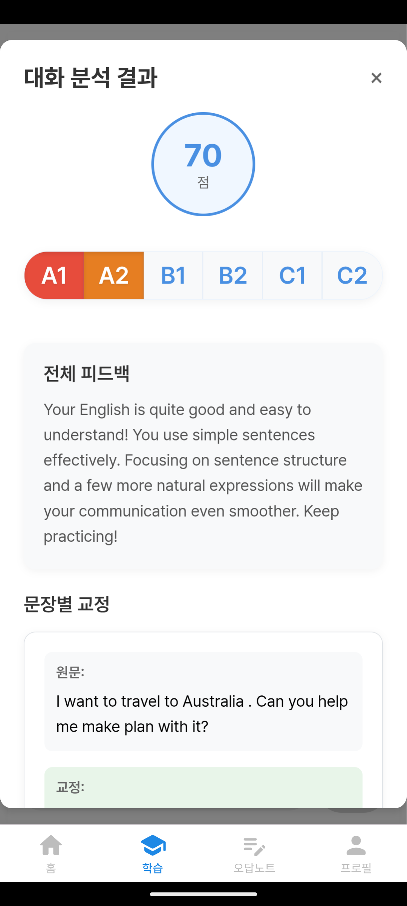
    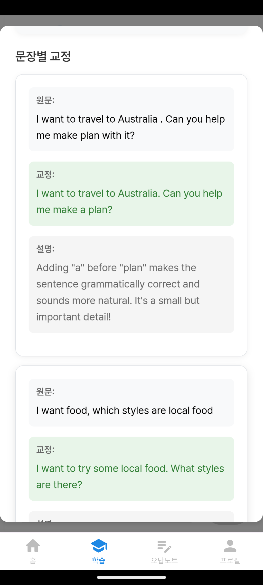
  - `scrap_screen.png`: Web page context scrap
    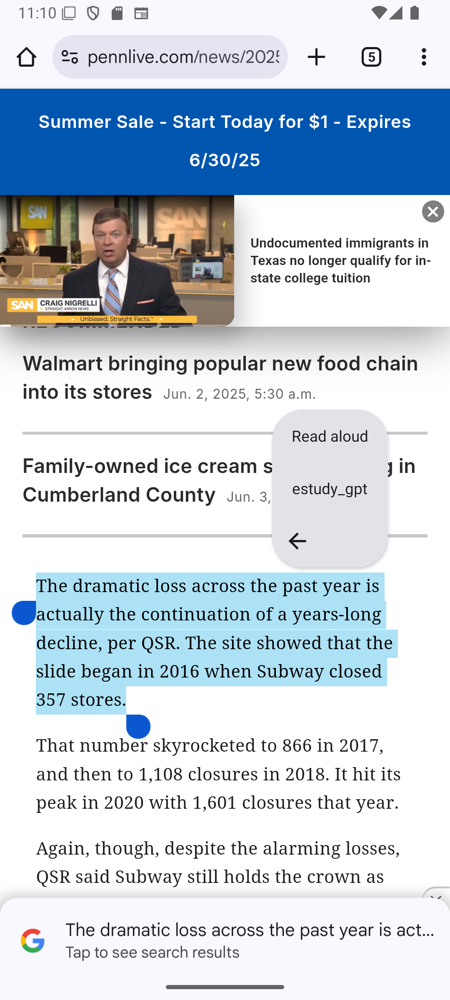
    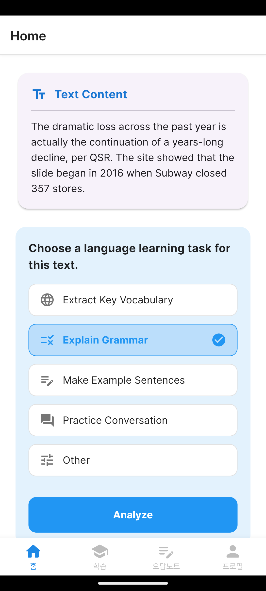
    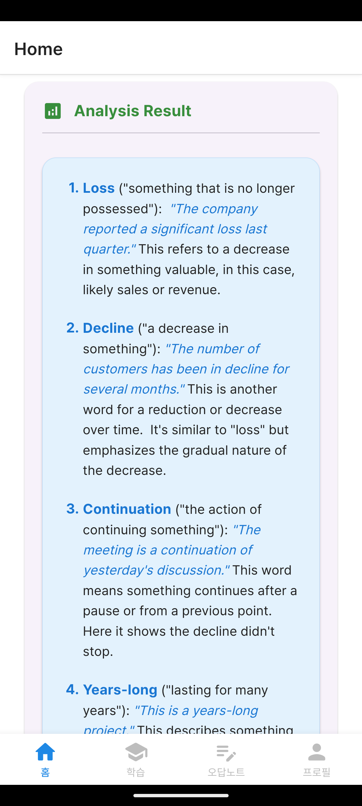
  - `wrong_note_screen.png`: List of wrong notes, detail/edit buttons
    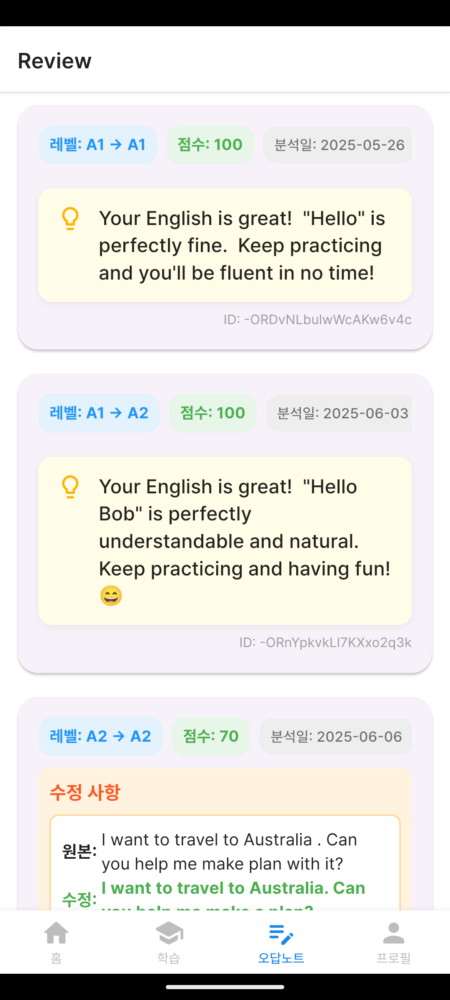
  - `pdf_share_screen.png`: List of wrong notes, detail/edit buttons
    

## 6. API Documentation

- **List of Endpoints:**
  Certainly! Here’s how you would write an API Documentation section for your Flutter app, based on your use of Firebase Authentication, Firebase Database, Firebase Storage, and the shared intent handler. This documentation is written in a clear, professional style suitable for your project documentation.
  | Feature | Method/Action | Endpoint/Path/Channel | Description | Auth Required |
  |------------------------|---------------------------|-------------------------------|---------------------------------------------|--------------|
  | Authentication | Sign In | Firebase Auth | Sign in user with email & password | No |
  | | Get User Token | Firebase Auth | Retrieve current user's ID token | Yes |
  | | Sign Out | Firebase Auth | Sign out current user | Yes |
  | Database | Read User Profile | /users/{uid} | Get user profile from Firestore/RTDB | Yes |
  | | Write User Profile | /users/{uid} | Update user profile | Yes |
  | Storage | Upload File | /users/{uid}/files/{file} | Upload media file to Firebase Storage | Yes |
  | | Download File | /users/{uid}/files/{file} | Download media file from Firebase Storage | Yes |
  | WebView Bridge | Send Auth Data to WebView | JS Channel: FlutterBridge | Send user info/token to WebView (React) | Yes |
  | | Receive Message from Web | JS Channel: FlutterBridge | Handle navigation/content messages | Yes |
  | Shared Intent | Receive Shared Files | Platform Channel/Intent | Handle files/text shared from other apps | No |

- **Request/Response Examples:**

  1.  Firebase Authentication<br>
      **Sign In (Email/Password)**

      ```
      UserCredential userCredential = await FirebaseAuth.instance.signInWithEmailAndPassword(
        email: 'user@example.com',
        password: 'password123',
      );
      ```

      **Response**

      ```
      {
        "user": {
          "uid": "abc123",
          "email": "user@example.com",
          "displayName": "John Doe"
        }
      }

      ```

      **Get User Token**

      ```
      String? token = await user.getIdToken(true);
      ```

      **Response**

      ```
      {
        "token": "eyJhbGciOiJIUzI1NiIsInR5cCI6IkpXVCJ9..."
      }
      ```

  2.  Firebase Database (Firestore/Realtime Database)<br>
      **Read User Profile**

      ```
      final doc = await FirebaseFirestore.instance.collection('users').doc(uid).get();
      ```

      **Response**

      ```
      {
        "uid": "abc123",
        "email": "user@example.com",
        "displayName": "John Doe",
        "photoUrl": "https://..."
      }
      ```

      **Write User Profile**

      ```
      await FirebaseFirestore.instance.collection('users').doc(uid).set({
        "displayName": "New Name"
      });

      ```

  3.  Firebase Storage<br>
      **Upload File**

      ```
      final ref = FirebaseStorage.instance.ref().child('users/$uid/files/$filename');
      await ref.putFile(file);

      ```

      **Response:**<br>
      Success: Returns a StorageTaskSanpshot with metadata

      **Download File**

      ```
      {
        final url = await ref.getDownloadURL();
      }

      ```

      **Response**

      ```
      {
        "downloadUrl": "https://firebasestorage.googleapis.com/..."
      }
      ```

  4.  WebView Bridge (Flutter <-> WebView)<br>
      **Send User Data to WebView**

      ```
      controller.runJavaScript('''
      window.postMessage({
        type: 'auth:success',
        email: '$email',
        displayName: '$displayName',
        photoUrl: '$photoUrl',
        accessToken: '$accessToken',
        uuid: '$uuid',
      }, '*');
      ''');
      ```

      **WebView Receives:**

      ```
      {
        "type": "auth:success",
        "email": "user@example.com",
        "displayName": "John Doe",
        "photoUrl": "...",
        "accessToken": "...",
        "uuid": "abc123"
      }
      ```

      **Recieve Message from WebView**

      ```
      {
        "type": "router:push",
        "path": "https://example.com/page"
      }
      ```

  5.  Shared Intent Handler<br>
      **Received Shared Files/Text**

      - Android/iOS system shares file/text to app
      - Handler saves data to local storage and triggers a callback

      ```
      {
        "type": "file",
        "filePaths": ["/storage/emulated/0/Download/file.pdf"],
        "text": "",
        "timestamp": "2025-06-06T12:00:00Z"
      }

      ```

      or

      ```
      {
        "type": "text",
        "filePaths": [],
        "text": "Shared text content",
        "timestamp": "2025-06-06T12:00:00Z"
      }
      ```

- **Error Codes and Handling:**
  | Code/Status | Description | Handling Recommendation |
  |-------------------------------------|--------------------------------------|--------------------------------------------|
  | firebase_auth/user-not-found | User not found | Show "User does not exist" message |
  | firebase_auth/wrong-password | Incorrect password | Show "Incorrect password" message |
  | firebase_auth/network-request-failed| Network error | Show "Check your internet connection" |
  | permission-denied | No permission for DB/Storage | Prompt user to check permissions/login |
  | storage/object-not-found | File not found in Storage | Show "File not found" message |
  | webview/error | WebView failed to load page/message | Show error UI, allow retry |
  | intent/error | Failed to process shared intent | Show error message, log error |

  **General Handling Recommendations**

  - For all errors, display user-friendly messages.
  - Log errors for analytics/debugging.
  - For authentication errors, prompt re-login if necessary.
  - For network errors, allow user to retry.

## 7. Setup & Deployment

### Development Environment Setup

1. **Prerequisites**

   - Install a code editor (e.g., VSCode, Android Studio).
   - Install Flutter SDK for your OS.
   - Install Node.js and npm.
   - Install Git.
   - Sign up for a Firebase account and create a Firebase project.

2. **Install Required CLI Tools**

   - Install Firebase CLI globally:
     ```
     npm install -g firebase-tools
     ```
   - Log in to Firebase:
     ```
     firebase login
     ```
   - (For Flutter) Install FlutterFire CLI:
     ```
     dart pub global activate flutterfire_cli
     ```

3. **Configure Firebase for Flutter**

   - In your Flutter project directory:
     ```
     flutterfire configure
     ```
   - Follow prompts to select platforms and your Firebase project.
   - This generates `firebase_options.dart` in your `lib/` directory.

4. **Add Firebase Plugins (Flutter)**

   - Add required plugins:
     ```
     flutter pub add firebase_core
     flutter pub add firebase_auth
     flutter pub add cloud_firestore
     flutter pub add firebase_storage
     ```
   - Initialize Firebase in `main.dart`:

     ```
     import 'package:firebase_core/firebase_core.dart';
     import 'firebase_options.dart';

     void main() async {
       WidgetsFlutterBinding.ensureInitialized();
       await Firebase.initializeApp(
         options: DefaultFirebaseOptions.currentPlatform,
       );
       runApp(const MyApp());
     }
     ```

5. **Set Up Firebase in React**

   - In your React project directory:
     ```
     npm install firebase
     ```
   - Initialize Firebase in your React code:

     ```
     // src/firebase.js
     import { initializeApp } from 'firebase/app';

     const firebaseConfig = {
       apiKey: "...",
       authDomain: "...",
       projectId: "...",
       storageBucket: "...",
       messagingSenderId: "...",
       appId: "..."
     };

     const app = initializeApp(firebaseConfig);
     export default app;
     ```

---

### Build and Deployment Procedures

#### 1. Build Your Apps

- **React Web**
  - `npm run build`
  - Output: 'build'

#### 2. Set Up Firebase Hosting

1. **Initialize Firebase Hosting (once per project)**

- `firebase init hosting`
- Select your Firebase project.
- Set public directory:
  - Flutter: `build/web`
  - React: `build`
- Configure as a single-page app? (Yes)
- Do not overwrite `index.html` unless you want to reset it.

2. **Deploy to Firebase Hosting**

- `firebase deploy`
- Your app will be available at:
- `https://<your-project-id>.web.app`
- `https://<your-project-id>.firebaseapp.com`

#### 3. Hosting Multiple Apps (Optional)

- To host both Flutter and React apps under different routes:
- Use "rewrites" in `firebase.json`:

  ```
  {
    "hosting": {
      "rewrites": [
        { "source": "/flutter/**", "destination": "/flutter/index.html" },
        { "source": "/react/**", "destination": "/react/index.html" }
      ]
    }
  }
  ```

- Place each built app in the corresponding folder (e.g., `public/flutter`, `public/react`).

---

### Environment Variables/Configuration Files

- **Firebase Configuration**
- Flutter: `firebase_options.dart` (auto-generated)
- React: `.env` file or direct config

  ```
  REACT_APP_API_KEY=...
  REACT_APP_AUTH_DOMAIN=...
  REACT_APP_PROJECT_ID=...
  ```

- **Platform-Specific Files**
- Android: `android/app/google-services.json`
- iOS: `ios/Runner/GoogleService-Info.plist`
- Web: Config object in code or `.env`

- **.env Files (Optional)**
- Store sensitive or environment-specific variables in `.env`.
- Use `flutter_dotenv` (Flutter) or `dotenv` (React) to load them.

---

**References:**

- [Firebase Hosting Documentation](https://firebase.google.com/docs/hosting)
- [Create React App: Deployment](https://create-react-app.dev/docs/deployment/#firebase)

## 8. Maintenance & Reference

### Common Issues and Solutions

1. **Firebase Authentication Failures**

   - Issue: Users unable to log in or token refresh failures.
   - Solution: Check network connectivity, ensure Firebase project configuration is correct, and verify token refresh logic.

2. **WebView Loading Errors**

   - Issue: WebView fails to load pages or JavaScript errors.
   - Solution: Verify URLs, check JavaScript channel setup, and ensure WebView permissions are granted.

3. **Shared Intent Handling Issues**

   - Issue: Shared files or text not received or processed correctly.
   - Solution: Confirm platform permissions, test intent listeners, and validate data storage logic.

4. **Firebase Firestore/Database Permission Denied**

   - Issue: Read/write operations fail due to permission errors.
   - Solution: Review Firestore rules, ensure authenticated user has correct roles.

5. **Firebase Storage Upload/Download Failures**

   - Issue: Media files fail to upload or download.
   - Solution: Check storage rules, network status, and file size limits.

6. **App Crashes on Initialization**

   - Issue: App crashes during Firebase initialization or WebView setup.
   - Solution: Ensure all async initializations are awaited, check for null safety issues.

7. **Performance Issues**
   - Issue: Slow app startup or UI lag.
   - Solution: Optimize Firebase queries, lazy load WebView content, and minimize heavy UI operations.

---

### Reference Documents/Links

- [Flutter Official Documentation](https://flutter.dev/docs)
- [Firebase for Flutter](https://firebase.flutter.dev/)
- [WebView Flutter Plugin](https://pub.dev/packages/webview_flutter)
- [Firebase Authentication](https://firebase.google.com/docs/auth)
- [Firebase Firestore](https://firebase.google.com/docs/firestore)
- [Firebase Storage](https://firebase.google.com/docs/storage)
- [Receive Sharing Intent Plugin](https://pub.dev/packages/receive_sharing_intent)
- [FlutterFire CLI](https://firebase.flutter.dev/docs/cli)
- [Firebase Hosting](https://firebase.google.com/docs/hosting)
- [React Official Documentation](https://reactjs.org/docs/getting-started.html)

---

### Future Improvements

1. **Enhance WebView Integration**

   - Improve communication between Flutter and WebView with more robust message handling.
   - Add support for more complex interactions and events.

2. **Expand Authentication Options**

   - Add social login providers (Google, Facebook, Apple).
   - Implement multi-factor authentication for enhanced security.

3. **Improve Shared Intent Handling**

   - Support more file types and larger files.
   - Add better error handling and user feedback.

4. **Optimize Firebase Usage**

   - Implement offline data persistence and sync.
   - Optimize Firestore queries and indexing.

5. **UI/UX Enhancements**

   - Add animations and transitions for smoother user experience.
   - Improve accessibility features.

6. **Performance Improvements**

   - Reduce app startup time.
   - Optimize memory usage and reduce battery consumption.

7. **Automated Testing and CI/CD**
   - Add unit, widget, and integration tests.
   - Set up continuous integration and deployment pipelines.
